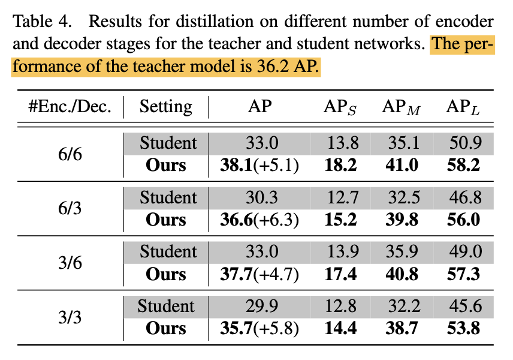

---
title: "DETRDistill: A Universal Knowledge Distillation Framework for DETR-families"
date: 2024-01-09 17:00:00 +09:00
categories: [Paper Reading]
tags:
   [
    Object Detection,
    DETR,
    KD
   ]
use_math: true
---   
# DETRDistill: A Universal Knowledge Distillation Framework for DETR-families
[ICCV 2023](https://openaccess.thecvf.com/content/ICCV2023/html/Chang_DETRDistill_A_Universal_Knowledge_Distillation_Framework_for_DETR-families_ICCV_2023_paper.html)
, 2024-01-09 기준 5회 인용

## Task
- Object Detection
- DETR
- Knowledge Distillation

## Contribution
- DETR-families 를 위한 knowlege distillation method 를 제안
- Hungarian-matching logits distillation
- Target-aware feature distillation
- Query-prior assignment distillation

<!--  -->
<!--  -->

Teacher: ResNet-101 
Student: ResNet-50 

본 논문에서 제안하는 방식으로 DETR 방법들에 대해서 KD를 적용했을 때 Teacher 를 뛰어넘는 Student 성능을 보여준다

## Proposed Method

### Analyze KD methods desigend for convolution-based detectors

### Hungarian-matching Logits Distillation

### Target-aware Feature Distillation

### Query-prior Assignment Distillation

### Overall Loss

## Experimental Results
<!--  -->

<!--  -->