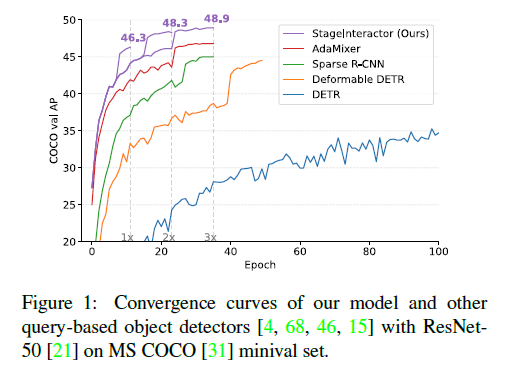
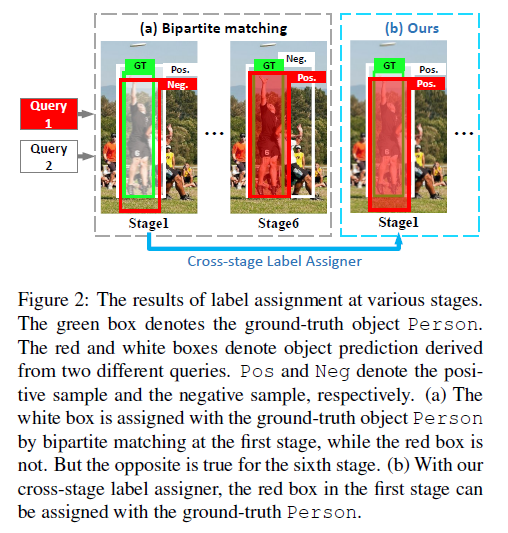
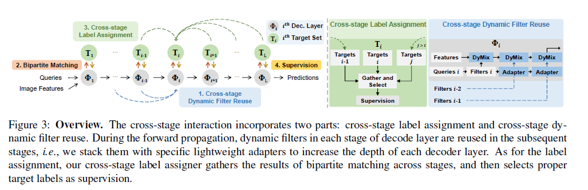
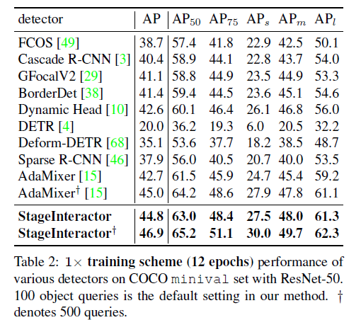

---
title: "StageInteractor: Query-based Object Detector with Cross-stage Interaction"
date: 2024-01-23 23:00:00 +09:00
categories: [Paper Reading]
tags:
   [
    Object Detection,
    DETR
   ]
use_math: true
--- 

# StageInteractor: Query-based Object Detector with Cross-stage Interaction
[ICCV 2023](https://openaccess.thecvf.com/content/ICCV2023/html/Teng_StageInteractor_Query-based_Object_Detector_with_Cross-stage_Interaction_ICCV_2023_paper.html), 2024-01-23 기준 2회 인용

## Task
- Object Detection
- DETR

## Contribution
- 기존 DETR의 one-to-one matching 방법들은 모델에게 string fine-grained discrimination 을 요구하게 된다
- Cross-stage interaction 구조를 제안
- Reuse dynamic operators with lightweights adapters (Adamixer)

본 논문에서 제안하고 있는 방법을 적용했을 경우 성능이 향상된다

## Motivation

> This strict bipartite matching would ask the detector to capture details to distinguish the predictions

Figure 2(a) 에서 Stage1 의 white box는 GT와 할당되어 Positive로 정확하게 예측  
하지만 red box 는 GT와 많이 겹침에도 불구하고 GT와 할당되지 않아 negative로 예측  
Stage 6 에서는 반대가 되는 문제도 보여준다

본 논문에서 제안하고자 하는 것은 이런 문제를 해결하여 두 query에 대한 결과가 모두 정확하게 하는 것

## Proposed Method

### Cross-stage Label Assignment

### Cross-stage Dynamic Filter Reuse

## Experimental Results
기본적으로 AdaMixer 방법에 제안하는 방법을 적용

제안하는 방법을 AdaMixer에 적용했을 때 성능이 제일 좋다

