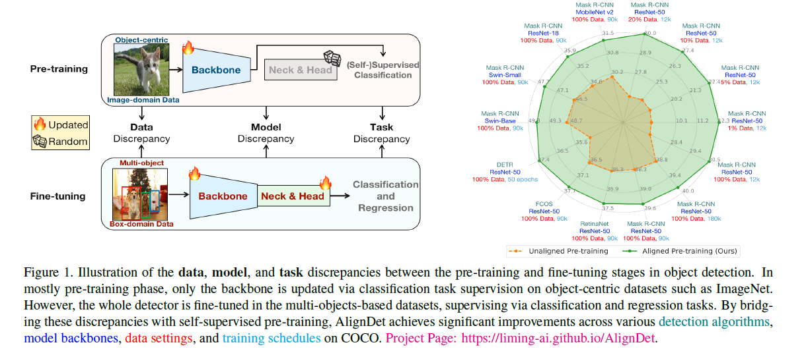
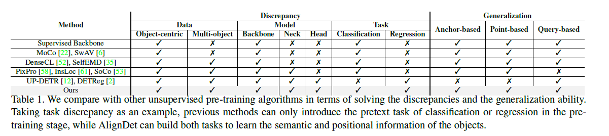

---
title: "AlignDet: Aligning Pre-training and Fine-tuning in Object Detection"
date: 2024-01-28 17:00:00 +09:00
categories: [Paper Reading]
tags:
   [
    Object Detection,
    DETR
   ]
use_math: true
--- 

# AlignDet: Aligning Pre-training and Fine-tuning in Object Detection
[ICCV 2023](https://openaccess.thecvf.com/content/ICCV2023/html/Li_AlignDet_Aligning_Pre-training_and_Fine-tuning_in_Object_Detection_ICCV_2023_paper.htmll), 2024-01-23 기준 1회 인용

## Task
- Object Detection
- DETR
  

## Contribution
- 기존의 방법들은 pre-training 과정과 fine-tuning 과정이 서로 불일치하는 문제가 존재한다
- data, model, task 관점에서 discrepancies 가 존재한다
- Pre-training 과정을 image-domain 과 box-domain 으로 two-stage 로 나눈 구조를 제안
- 제안하는 방법을 다양한 Detector 에 적용할 수 있으며, 유의미한 성능향상을 보여준다

## Motivation

- Data Discrepancy
  - Pre-training 에서 학습에 사용되는 데이터셋은 ImageNet과 같이 하나의 Object가 중심이 데이터셋을 활용
  - Fine-tuning 에서는 Multi-object 들이 존재하는 데이터셋을 활용
- Model Discrepancy
  - Pre-training 과정에서는 Backbone 만 학습하고 Detector 에서 중요한 Neck&Head는 random initialization 되고 Fine-tuing
- Task Discrepancy
  - Pre-training 에서는 classification task 로 학습되기 때문에 object detection 에서 필요한 object-aware positional context 정보를 포함하지 못함

Data, object, model discrepancies 를 해결하는 방법을 제안
- Image-domain pre-training
- Box-domain pre-training
- 다양한 Detector 에 적용할 수 있는 Generalization 도 갖추었다
  

## Proposed Method

## Experimental Results