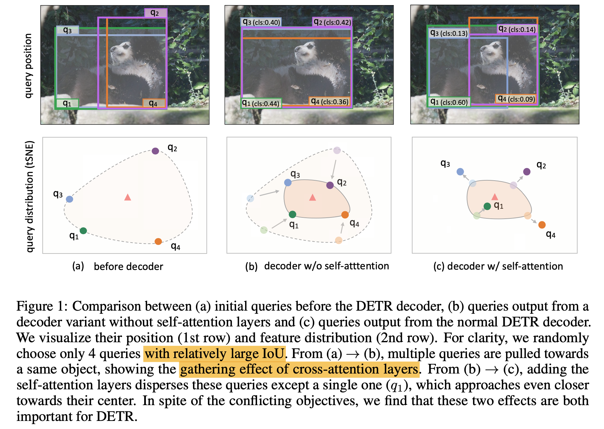

---
title: "DAC-DETR: Divide the Attention Layers and Conquer"
date: 2024-02-27 18:00:00 +09:00
categories: [Paper Reading]
tags:
   [
    Object Detection,
    DETR
   ]
use_math: true
--- 

# DAC-DETR: Divide the Attention Layers and Conquer
[NeurIPS 2023](https://proceedings.neurips.cc/paper_files/paper/2023/hash/edd0d433f8a1a51aa11237a6543fc280-Abstract-Conference.html), 2024-02-27 기준 1회 인용

## Task
- Object Detection
- DETR

## Contribution
- cross-attention 과 self-attention 이 서로 다른 impact를 주는 것을 발견
- 서로 다른 역할을 하눈 두 attention 을 효율적으로 학습하기 위한 Divide-And-Conquer DETR (DAC-DETR) 구조를 제안
- auxiliary decoder 를 통해서 cross-attetion layers 가 효과적으로 학습되도록 함

## Motivation

이미 학습 완료된 Deformable DETR 을 기반으로 분석  
Query 선택은 IoU 큰 query 4개를 선택  
첫번째 행은 box position, 두번째 행은 feature distribution

(a) 는 decoder 이전의 query 를 visualization

*Cross-attention layers tend to gather multiple queries around the same object*

- (b) 는 self-attention layer 를 빼고 cross-attention layer 만 사용했을 때 결과
- (a) 의 query 들보다 object 중심으로 모이게 하는 효과가 있음
  
-> Cross-attention layers 는 여러 queries 를 같은 object 으로 모이게 하는 영향이 있다

*Self-attention layers disperse these queries from each other*

- (c) 는 self-attention layers, cross-attention layers 모두 사용한 일반 Deformable DETR 결과
- 한개의 query를 제외하고 object 로부터 멀어지는 효과가 있음, 한개의 query는 object에 더 가까워 진다
  
-> Self-attention layers 는 single query만 object에 가깝게 하고 나머지는 멀어지게 한다

> self-attention layers play a critical role in removing duplicates

## Proposemd Method

## Experimental Results